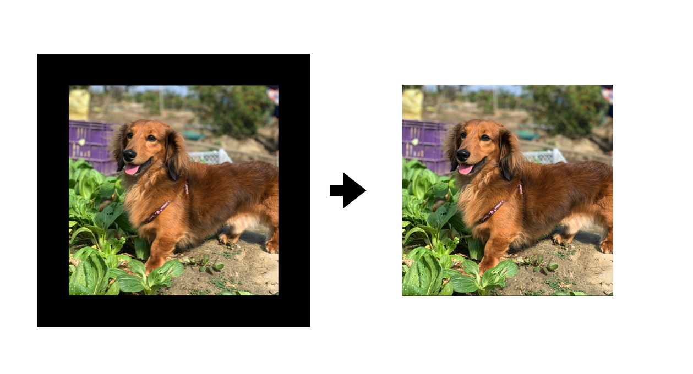
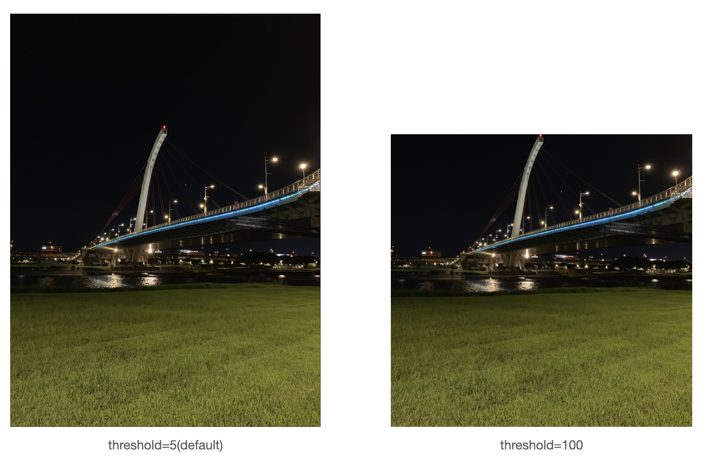

# Image Black Border Removal




<br>

## Package install:

* opencv-python
* PIL
* numpy

```shell
pip install -r requirement.txt
```

<br>

## Usage:

```shell
python python3 main.py ./IMG_2543_1.jpg [--output_dir] [--threshold]
```

### Other argument:

* `--output_dir`: Where to store the result, and create the directory manually.
* `--threshold`:default=5, the maximum is 255, the higher the threshold, the lighter color of the border will be cut out, it depends on the noise of your image border is.

### Result




